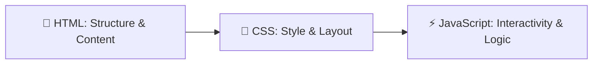

# 📘 Complete Beginner's JavaScript Learning Guide

Welcome to the **JavaScript Learning Guide**! This document explains how JavaScript works from the ground up, how it powers web applications, and provides a clear breakdown of every single line of code in the **Interactive JavaScript Playground**.

---

## 📑 Table of Contents

1. [How JavaScript Connects to HTML & CSS](#1-how-javascript-connects-to-html--css)
2. [Core Fundamentals You Need to Know](#2-core-fundamentals-you-need-to-know)
   - Variables & Data Types
   - Functions (Regular vs Arrow)
   - DOM Manipulation (Selecting & Modifying Elements)
   - Event Listeners (Reacting to User Interactions)
   - Arrays & Objects
   - Timers (`setInterval` & `setTimeout`)
   - Browser Storage (`localStorage`)
3. [Deep Dive: The 7 Playground Mini-Apps](#3-deep-dive-the-7-playground-mini-apps)
   - App 1: Live Clock & Stopwatch
   - App 2: Interactive Counter
   - App 3: Real-Time Text Analyzer
   - App 4: Random Color Generator & Clipboard
   - App 5: Smart To-Do List (CRUD)
   - App 6: Interactive Quiz Challenge
   - App 7: Browser Storage Inspector
4. [Pro Developer Tips & Debugging](#4-pro-developer-tips--debugging)

---

## 1. How JavaScript Connects to HTML & CSS

Every modern website is built on three pillars:



- **HTML** provides elements: `<button id="myBtn">Click Me</button>`
- **CSS** styles them: `#myBtn { background: blue; color: white; }`
- **JavaScript** breathes life into them:
  ```javascript
  const btn = document.getElementById("myBtn");
  btn.addEventListener("click", () => {
    alert("You clicked the button!");
  });
  ```

### Linking JavaScript in HTML

Always link your JavaScript file before the closing `</body>` tag so the browser finishes reading the HTML elements first:

```html
  <script src="app.js"></script>
</body>
</html>
```

---

## 2. Core Fundamentals You Need to Know

### A. Variables (`let` vs `const`)

Variables are named storage containers for data:

```javascript
// Use 'let' when the value WILL change later:
let score = 0;
score = score + 5; // Valid!

// Use 'const' when the value NEVER changes:
const apiKey = "xyz123";
const maxScore = 100;
// maxScore = 200; // Error: Assignment to constant variable!
```

### B. Functions

A function is a reusable machine that takes input, does something, and optional returns output:

```javascript
// Method 1: Standard function
function addNumbers(a, b) {
  return a + b;
}

// Method 2: Modern ES6 Arrow function (shorter and cleaner!)
const multiply = (a, b) => a * b;

console.log(addNumbers(3, 4)); // Output: 7
console.log(multiply(3, 4)); // Output: 12
```

### C. The DOM (Document Object Model)

The DOM turns every HTML tag into a JavaScript object you can manipulate:

```javascript
// 1. Finding elements
const heading = document.getElementById("mainTitle");
const buttons = document.querySelectorAll(".btn");

// 2. Changing text
heading.textContent = "Welcome to my App!";

// 3. Changing CSS classes
heading.classList.add("highlight");
heading.classList.remove("hidden");
heading.classList.toggle("dark-mode");
```

### D. Event Listeners

Event listeners tell JavaScript to wait for user actions (clicks, keypresses, mouse movement, form submits):

```javascript
const myInput = document.getElementById("username");

// Fires every time a key is pressed inside the input box
myInput.addEventListener("input", (event) => {
  console.log("User typed:", event.target.value);
});
```

### E. Arrays and Objects

```javascript
// Array = Ordered list of items
const fruits = ["Apple", "Banana", "Orange"];
fruits.push("Mango"); // Adds Mango to end
console.log(fruits[0]); // "Apple"

// Object = Group of key-value pairs
const user = {
  name: "Alex",
  level: 1,
  isLoggedIn: true,
};
console.log(user.name); // "Alex"
```

---

## 3. Deep Dive: The 7 Playground Mini-Apps

### ⏰ App 1: Live Clock & Stopwatch

- **Key Methods**: `new Date()`, `setInterval(callback, delayMs)`, `clearInterval(timerId)`
- **How it works**:
  Every 1000 milliseconds, JavaScript queries the system clock, extracts hours/minutes/seconds, pads single digits (e.g. `9` becomes `09`), and updates `document.getElementById("liveTime").textContent`.

### 🔢 App 2: Interactive Counter

- **Key Concepts**: State variables (`let count = 0`), Event Handlers, `element.classList.add()`
- **How it works**:
  Clicking `+` or `-` increases or decreases `count` by the chosen step dropdown. Conditional `if (count > 0)` checks update the CSS color to green for positive, red for negative, and gray for zero.

### ✍️ App 3: Live Text Analyzer

- **Key Concepts**: `'input'` event listener, `string.length`, `string.split(/\s+/)`, `string.trim()`
- **How it works**:
  Listens to the input in real-time. Computes total characters, words, sentences, and estimated reading time dynamically.

### 🎨 App 4: Random Color Generator & Clipboard

- **Key Concepts**: `Math.random()`, `Math.floor()`, `navigator.clipboard.writeText()`
- **How it works**:
  Picks 6 random hexadecimal characters from `"0123456789ABCDEF"`. Applies the color to the preview element's `style.backgroundColor` and copies it to clipboard on click.

### 📝 App 5: Smart To-Do List (CRUD)

- **Key Concepts**: `JSON.stringify()`, `JSON.parse()`, `localStorage.setItem()`, `array.filter()`
- **How it works**:
  Tasks are stored as an array of objects: `{ id: 1690000000, text: "Task name", completed: false }`. Whenever an item is added, toggled, or deleted, the array is saved to `localStorage` as JSON text so it persists on page reload.

### 🎓 App 6: Interactive JavaScript Quiz

- **Key Concepts**: Array of question objects, index tracking, scoring logic
- **How it works**:
  Renders question #0. When an answer is clicked, JS checks `selectedIndex === question.correct`. If correct, adds 10 points and highlights green; otherwise highlights red. Advances to the next question until finished.

### 💾 App 7: Browser Storage Inspector

- **Key Concepts**: `localStorage.getItem()`, `localStorage.clear()`
- **How it works**:
  Displays the raw data stored inside the browser's key-value storage engine in real time.

### 🎛️ App 8: Handlers — `ontoggle` & `onsave`

- **Key Concepts**: `ontoggle` event, Custom Save Handlers, Keyboard Interception (`Ctrl+S` / `Cmd+S`), `CustomEvent`
- **How it works**:
  1. **`ontoggle`**: Listens for state toggles on `<details>` elements or custom toggles. When expanded or collapsed, `event.target.open` gives the boolean state (`true` / `false`).
  2. **`onsave`**: Implements save logic to write text to `localStorage`. Listens to the `keydown` event on the window/input, checks `e.ctrlKey && e.key === 's'`, and cancels the browser's native webpage download with `e.preventDefault()`, immediately executing the save function instead!
  ```javascript
  // Intercepting Ctrl+S to trigger onSave
  window.addEventListener("keydown", (e) => {
    if ((e.ctrlKey || e.metaKey) && e.key.toLowerCase() === "s") {
      e.preventDefault(); // Stop default browser download dialog
      handleSave(); // Run custom save handler
    }
  });
  ```

### 🔒 App 9: Password Validator & Form Security

- **Key Concepts**: `RegExp.test()`, input event, toggling password visibility
- **How it works**: Uses regular expressions to verify minimum 8 characters (`.length >= 8`), digits (`/\d/`), and special characters (`/[!@#$%^&*]/`).

### 🔄 App 10: Array Transformation Lab (.map, .filter, .reduce)

- **Key Concepts**: Functional array manipulation
- **How it works**:
  - `.map()` transforms every element and returns a new array of the same length.
  - `.filter()` returns a new array with items that pass a boolean test.
  - `.reduce()` accumulates all elements into a single value (e.g. sum).

### 🌐 App 11: Async / Fetch API & Mock Server

- **Key Concepts**: `fetch()`, `async/await`, `Promise`, `try/catch`
- **How it works**: Requests data asynchronously across the network without blocking the browser UI thread.

### 📦 App 12: ES6 Classes & Object-Oriented JS

- **Key Concepts**: `class`, `constructor()`, `this`, methods
- **How it works**: Creates reusable object blueprints with shared properties and behavior.

### ⏱️ Debouncing: Search Filter on Typing Break

- **Key Concepts**: `setTimeout`, `clearTimeout`, Higher-Order Functions
- **How it works**: Instead of executing search on every micro-keystroke, debouncing waits until the user pauses (e.g., 350ms break) before running the filter:

```javascript
function debounce(fn, delay = 350) {
  let timer;
  return (...args) => {
    clearTimeout(timer);
    timer = setTimeout(() => fn.apply(this, args), delay);
  };
}
```

---

## 4. Class Works & Practice Coding Challenges

### Challenge 1: Reverse a String

```javascript
function reverseString(str) {
  return str.split("").reverse().join("");
}
```

### Challenge 2: FizzBuzz Generator

```javascript
function fizzBuzz(n) {
  for (let i = 1; i <= n; i++) {
    if (i % 15 === 0) console.log("FizzBuzz");
    else if (i % 3 === 0) console.log("Fizz");
    else if (i % 5 === 0) console.log("Buzz");
    else console.log(i);
  }
}
```

### Challenge 3: Palindrome Validator

```javascript
function isPalindrome(str) {
  const clean = str.toLowerCase().replace(/[^a-z0-9]/g, "");
  return clean === clean.split("").reverse().join("");
}
```

### Challenge 4: Max & Min in Array

```javascript
function findMaxMin(arr) {
  return { max: Math.max(...arr), min: Math.min(...arr) };
}
```

### Challenge 5: Count Vowels in Sentence

```javascript
function countVowels(str) {
  const matches = str.match(/[aeiou]/gi);
  return matches ? matches.length : 0;
}
```

---

## 5. Pro Developer Tips & Debugging

1. **Always use Developer Tools**: Press `F12` on Chrome/Edge/Firefox to open the Console tab.
2. **Use `console.log()` everywhere** when testing:
   ```javascript
   console.log("Checking value of count:", count);
   ```
3. **Keep functions small**: A function should do ONE thing well.
4. **Use meaningful names**: Instead of `let x = 5;`, write `let score = 5;`.

---

🎉 **You are now ready to experiment! Open `index.html` in your browser and start tweaking the code!**
